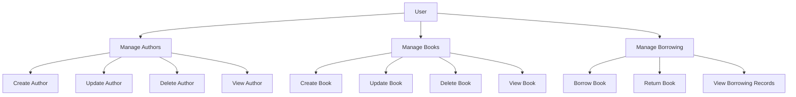

# Library Management System

This project is a Library Management System built with Symfony, implementing Domain-Driven Design (DDD) and Clean Architecture principles.

## Project Overview

The Library Management System allows users to manage books, authors, and borrowing records. It provides functionalities for creating, updating, and deleting books and authors, as well as managing book borrowing and returns.

## Use Cases Schema



## How to Run the Project

Follow these steps to set up and run the project:

1. Clone the repository:
   ```
   git clone <repository-url>
   cd <project-directory>
   ```

2. Install dependencies:
   ```
   composer install
   ```

3. Set up the database:
   - Create a new database for the project
   - Update the DATABASE_URL in your .env.local file

4. Run database migrations:
   ```
   php bin/console doctrine:migrations:migrate
   ```

5. Load fixtures (optional):
   ```
   php bin/console doctrine:fixtures:load
   ```

6. Start the Symfony development server:
   ```
   symfony server:start
   ```

7. Access the application in your web browser at `http://localhost:8000`

## Running Tests

To run the test suite:

```
php bin/phpunit
```

## Additional Commands

- To create a new user:
  ```
  php bin/console app:create-user
  ```

- To clear cache:
  ```
  php bin/console cache:clear
  ```

## Contributing

Please read CONTRIBUTING.md for details on our code of conduct and the process for submitting pull requests.

## License

This project is licensed under the MIT License - see the LICENSE.md file for details.
